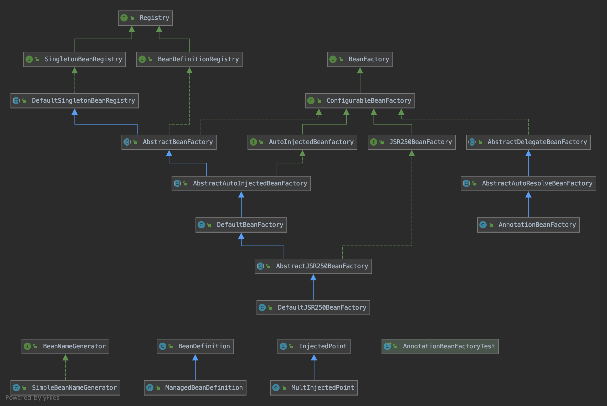

#### 自己动手实现的轻量级依赖注入框架V0.2版本
该框架仅用作学习使用，不可用于生产开发。

V0.2版本大量重构，项目结构更加合理。

该框架具有如下功能：
1. 可以通过注解标记组件类，被标记的类会被扫描并添加到容器中。
2. 解析组件类的依赖关系，进行依赖注入。
3. 解决组件类相互引用等异常情况。
4. 根据组件注解的描述信息，返回单例对象，或者返回新的对象。
5. AOP功能实现，并支持通过ProxyFactoryBean和Aspect注解配置

该框架遵从jsr330规范，实现了基本的依赖注入功能，同时支持Aop！
你可以运行示例来进行测试！

项目设计：

详细原理可参考本人博客 https://bdqfork.cn/articles/40

#### 更新日志:

bug fix: 
1. 在v0.1版本中，只要检测到两个组件内部有直接相互依赖的情况，就立即抛出异常，并没有尝试去解决依赖循环的问题，同时也忽略了组件之间间接循环引用的情况。
2. 在v0.1版本中，返回多实例对象，只在注入对象的时候有效，而不是类似于Spring中，在调用多实例对象方法时，返回一个新的实例来进行调用。

新功能:
1. 支持通过FactoryBean注入单实例到容器中。
2. 支持AOP。可以通过将目标实例，Advisor或者Advice配置到ProxyFactoryBean实例，并将ProxyFactoryBean实例注入到容器中的方式实现AOP拦截。
3. 同时支持使用AspectJ的注解，声明Aspect以及通知，实现AOP拦截。

##### todolist:
1. 完善测试用例

